# [MLOops]{v-mark.crossed-off=1} to MLOps

 
 

<v-click v-motion-pop-visible at=2>
<carbon-arrow-right/> Bringing ideas to production 🚀

March 15th, 2024
</v-click>

---
hideInToc: true
---

# Agenda

 

::left::

<Toc />

::right::

---
layout: presenter
photo: https://charlas.2023.es.pycon.org/media/avatars/blob_p6VtbO9.jpg
---

# About me

- 🇧🇷 → 🇧🇪: Brazilian @ Belgium
- 🤓 B.Sc. in Mechanical Engineering @PNW
- 👨‍🎓 M.Sc. in Artificial Intelligence @KUL
-  Professional Data & ML Engineer
-  Machine Learning Specialty
-  Terraform Associate
-  DAG Authoring & Airflow
-  SnowPro Core
-  Prefect Associate
- 🤪 Fun facts: 🐍, 🦀, 🐓
- 🫂 Python User Group Belgium 
- 📣 Confs: 🇯🇵, 🇵🇱, 🇮🇪, 🇵🇹, 🇪🇸, 🇸🇪
- 🎙️ Datatopics Unplugged Podcast 
- 🤖 Tech lead AI @ 

---
hideInToc: true
layout: default
---

# I have worked on different [Data/AI projects]{.gradient-text}

 

::left::

 
 

<v-clicks >

- Events company 📣
- No show prediction 🫥
- Record deduplication 👯‍♀️
- Recommend visitors and exhibitors 🤝
- PoC <carbon-arrow-right/> MVP <carbon-arrow-right/> Production 🚀

</v-clicks>

::right::

 
 
 

<v-click>
  
<Youtube id="SD3irxdKfxk" rounded-lg scale-130 shadow />
  
</v-click>

---
hideInToc: true
layout: twocols
---

# From the [prototyping]{.gradient-text} side...
 

::left::

<v-click>
  

  
</v-click>

::right::

 
 

<v-clicks >

- Content moderation @ social media company 🤬
- NER @ clinical studies 🔎
- Q&A chatbots @ automotive industry 🏎️
- Energy consumption forecasting @ public sector 📈
- Network analysis @ accounting company 🕸️

</v-clicks>

---
hideInToc: true
---

# ...to 
 production 
 applications

 

::left::

 
 
 

<v-clicks>

- Finacial sector 💰
- Early customer lifetime value 🤑
- Pipeline migrations 🧑‍🔧
- **Churn prediction 🫠**

</v-clicks>

::right::

---
hideInToc: true
---

# Why am I [here]{.gradient-text}?

 

  
## " To help us understand what it takes for a machine learning project takes to go from [idea to production]{v-mark.box.yellow=3}, looking closely at the differences between [machine learning]{.gradient-text} and [operations]{.gradient-text} "
  

---
layout: cover
title: What is  MLOps?
---

# Why MLOps?

---

# Use case: [content moderation]{.gradient-text}

  

  

`“pixel art angry face with symbols on mouth censoring profanity”` -  DALL·E 2

---
hideInToc: true
---

# What is [content moderation]{.gradient-text}?

::left::

 

<v-clicks depth=3>

- You're the CEO of 10gag ( congrats! 🉠)
	- (Like 9gag, but better) 
- Things haven't been so good lately 🫣
- Some people are leaving nasty comments 🤬
- You have an idea! 💡
	- You can probably detect these comments, and remove them from the platform
    - 
How well can we identify these comments using machine learning?

 
</v-clicks>

::right::

{.rounded-lg .shadow-lg .scale-80}

---

# So you build a [model]{.gradient-text}...

 
 

::right::

 

{.rounded .shadow-xl .object-contain v-click=1}

::left::

<v-clicks at=2>

👨‍💼 "How long will it take to go though 100 posts? How can we make it faster?"

👷‍♀️ "How can we make sure the model scales?"

👷‍♂️ "What packages did you use?"

😡 "Why is it removing my posts?"

👩‍🔬 "What models did you already try?"

🕵️ "What data was used to train this model?"

</v-clicks>

::bottom::

<v-click at=8>
 
<carbon-arrow-right /> [MLOps decreases the burden of deploying ML systems by following best practices]{v-mark.highlight.yellow=8}

</v-click>

---

# Real life [testimonials]{.gradient-text}

# [TODO]{.bg-red .flex-center .h-100}

“At this point, everybody does what they like, there is little to no standardisation. Since there are little to no best practices, the current platform contains the largest common denominator of a lot of heterogeneous projects. This causes a lot of burden in maintaining these projects”

“For quite some time, the focus was on more traditional Business Intelligence and Data Engineering. More recently we have seen the focus shifted more towards Advanced Analytics in the form of some scattered initiatives and products, which in turn lead to little success on these.”

“While I love our Data Science team, the code they write is not at all up to standards in comparison to what we normally push into production. This puts a heavy burden on the Data Engineering team to rewrite and refactor this. At the same time the Data Science team is often unhappy, because this refactoring process tends to introduce mistakes or misunderstandings.”

---
layout: cover
title: What is  MLOps?
---

# What is [ML]{v-mark.red=1}[Ops]{v-mark.circle.yellow=2}?

---

# What's in the [name]{.gradient-text}?

 

::left::

## Machine learning 🧠

 

<v-clicks>

- Experimentation
- Data exploration
- Modelling
- Hyperparameter tuning
- Evaluation

</v-clicks>

::right::

## Operations ⚙️

 

<v-clicks>

- Availability
- Scalability
- Reproducibility
- Monitoring/Alerting
- Automation

</v-clicks>

::bottom::

## [✨ MLOps ✨]{.flex .justify-center .'-mt-20' v-click}

---

# DevOps vs. [MLOps]{.gradient-text}

{.rounded .shadow .bg-blue .scale-50 v-click .'-mt-20' .'-mb-25'}

## [MLOps principles](https://ml-ops.org/content/mlops-principles):

"[...] By codifying these practices, we hope to accelerate the adoption of ML/AI in software systems and fast delivery of intelligent software. In the following, we describe a set of important concepts in MLOps such as [Iterative-Incremental Development, Automation, Continuous Deployment, Versioning, Testing, Reproducibility, and Monitoring]{v-mark="{type:'highlight', color:'yellow', multiline:true}"}."

---

# DevOps vs. [MLOps]{.gradient-text} ?

 

::left::

## MLOps
 

- Iterative-Incremental Development
- [Automation]{v-mark.blue="'+1'"}
- [Continuous Deployment]{v-mark.blue="'+1'"}
- Versioning
- [Testing]{v-mark.blue="'+1'"}
- [Reproducibility]{v-mark.blue="'+1'" v-mark.box.red=6}
- Monitoring

::right::

<v-click at='+2'>

## vs. DevOps

 

\+ Model

\+ Features

\+ Model

</v-click>

---

# So... what is it?

 

  
## “The [level]{v-mark.circle.blue=1} of automation of these steps defines the maturity of the ML process, which [reflects the velocity of training new models given new data or training new models given new implementations]{v-mark="{type:'highlight', color:'yellow', multiline:true, at:2}"}. The following sections describe three levels of MLOps, starting from the most common level, which involves no automation, up to automating both ML and CI/CD pipelines.”

## [- Google](https://cloud.google.com/architecture/mlops-continuous-delivery-and-automation-pipelines-in-machine-learning)

---

# (MLOps in theory vs. [practice]{.gradient-text})

[> “In theory, theory and practice are the same. In practice, they are not.” - Einstein]{v-click}

<iframe src="https://arxiv.org/ftp/arxiv/papers/2205/2205.02302.pdf" w-full h-95 rounded shadow-lg v-click/>

---

# Pop Quiz 💥

## For each of these challenges, which ones are related to [ML]{v-mark.highlight.red} or [Ops]{v-mark.highlight.cyan} ?

 

::left::

- [Locality of the data (distributional shift)]{v-mark.highlight.red=1}
- [Models and experiments are not properly tracked]{v-mark.highlight.cyan=2}
- [Model decay]{v-mark.highlight.red=3}
- [Changing business objectives]{v-mark.highlight.red=4}
- [Models monitoring and (re)trainining]{v-mark.highlight.cyan=5}
- [Retraining]{v-mark.highlight.red=6}
- [Data quality]{v-mark.highlight.red=7}

::right::

- [Consistent project structure]{v-mark.highlight.cyan=8}
- [Data availability]{v-mark.highlight.red=9}
- [Code and dependencies tracking]{v-mark.highlight.cyan=10}
- [Auditability and regulations - reproducibility and explainability]{v-mark.highlight.cyan=11}
- [Wrong initial assumptions (problem definition)]{v-mark.highlight.red=12}
- [Deploy model systems(not just one off solutions)]{v-mark.highlight.cyan=13}

---
layout: cover
---

# MLOps Illustrated
## ML Lifecyle Recap

---
hideInToc: true
---

---
hideInToc: true
---

# ML lifecycle & development (simplified)

```mermaid
%%{init: {"flowchart": {"htmlLabels": false}} }%%
flowchart LR
    idea["`💡
    Idea`"]
    poc["`Proof-of-Concept 🤖`"]
    mvp["`Minimal Viable Product 🦴`"]
    prod["`Iterate 🚀`"]
    
    idea --> poc --> mvp --> prod
```

```mermaid
%%{init: {"flowchart": {"htmlLabels": false}} }%%
flowchart LR
    eda["`Exploratory Data Analysis 🔎`"]
    model["`Modeling 📦`"]
    eval["`Evaluation ⚖️`"]
    deploy["`Deployment 🏗️`"]
    monitor["`Monitoring 👀`"]
    eval .-> model
    eval .-> eda    
    eda --> model --> eval --> deploy --> monitor
```

<v-clicks>

</v-clicks>

---

# Exploratory data analysis (EDA)

::left::

<v-clicks>

- Check that the data is available
- Join data sources
- Look for outliers and validate data correctness
- Create new features
- Tooling:
  	- Python <carbon-logo-python/>
    - SQL <carbon-db2-Database/>
    - Jupyter notebooks <carbon-logo-jupyter/>
  	- BI tooling/dashboards 

</v-clicks>

 
  
<v-clicks>

<carbon-arrow-right/> 
 Share and validate findings with business stakeholders 

- "Users that don't log in are the ones that leave"
- "Some users leave the platform because they are 'addicted'"

</v-clicks>

::right::

<v-click>

`“A data scientist at work as pixel art”`

</v-click>

<v-click>

`“A data analyst at work as pixel art”`
</v-click>

---

# Modeling

::left::

 
 

<v-clicks>

- Define data for training and testing
- Deal with class imbalance
- Define cost function
- Try different models
- Tune hyper parameters
- Iterate on different architectures
- Tooling:
  	- Python <carbon-logo-python/>
    - Jupyter notebooks <carbon-logo-jupyter/>

</v-clicks>

::right::

<v-click>

`“A data scientist at work as pixel art”`

</v-click>

<v-click>

`“ml engineer pixel art”`
</v-click>

---

# Evaluation

::left::

<v-clicks>

- **Define the appropriate metrics and plots**
- Compare model predictions with labeled data
- Compute metrics and build plots
- Assess feature imporance
- Check for anomalies (better performance in subgroups, etc.)
- Tooling:
  	- Python <carbon-logo-python/>
    - Jupyter notebooks <carbon-logo-jupyter/>

</v-clicks>

  
<v-clicks>

<carbon-arrow-right/> 
 Assess with business whether model performance is acceptable 

- Should we try other models?
- Should we build new features?
- **How will these predictions be used?**

</v-clicks>

::right::

<v-click>

`“A data scientist at work as pixel art”`
  

</v-click>

<v-click>

`“ml engineer pixel art”`
</v-click>

---

# Deployment

::left::

> (Congrats! 🉠Many projects don't get this far)

 

<v-clicks>

- Event-driven or scheduled? (<carbon-arrow-right/> batch or real time?)
- How much data?
- Where should the predictions go?
- Who should have access to it?
- How can we just make predictions for the new data?
- Define (re?)deployment strategy
- Tooling:
  	- Python <carbon-logo-python/>
    - Cloud <carbon-IbmCloudHpc />
  	- Orchestrators 
  	- Web servers 
  

</v-clicks>

::right::

<v-click>

`“ml engineer pixel art”`
</v-click>

<v-click>

`“mlops engineer pixel art”`
</v-click>

---

# Monitoring

::left::

<v-clicks>

- Will we know if the predictions were correct?
- What metrics should we use?
- Ensure that only "unbiased data" is monitored
  	- We may "poison" the data by acting on the predictions ☠️
- How often should the metrics be computed?
- Set up automatic alerts
- Set up automatic retraining
- Fix operational issues and triage ML issues
- Tooling:
  	- Python <carbon-logo-python/>
    - Cloud <carbon-IbmCloudHpc />
  	- Orchestrators 
  	- Monitoring services 
  

</v-clicks>

::right::

<v-click>

`“mlops engineer pixel art”`
</v-click>

<v-click>

`“data and cloud engineer pixel art”`
</v-click>

---

---
layout: iframe

# the web page source
url: https://sli.dev/custom/config-unocss
---
<!--
1. mlops definitions - operations?
2. ideal vs practical mlops
3. ML Lifecycle
4. use case, explained - content moderation
5. batch vs. real time
6. batch
7. real time
8. latency
9. examples
10. exercise/live demo
11. -->
