```mermaid
flowchart LR
  subgraph API
  	direction TB
  	cloud("☁️") <--> phone("📱")
  end
  API --> batch("🍪")
  API --> realtime("👟")
```

```mermaid
graph LR
    bread("🥖") <--> bike("🚴‍♀️") <--> person("🥸")
```

# [MLOops]{v-mark.crossed-off=1} to MLOps

<br/>
<br/>

<v-click v-motion-pop-visible at=2>
<carbon-arrow-right/> Bringing ideas to production 🚀

March 15th, 2024
</v-click>

---
hideInToc: true
---

# Agenda

<br/>
<br/>

::left::
<div class="w-120">
<Toc columns=2 />
</div>

::right::

<br/>
<br/>

<v-click>

</v-click>

<style>
li:not(li:first-child) {
  margin-top: 0;
}
</style>

---
layout: presenter
photo: https://charlas.2023.es.pycon.org/media/avatars/blob_p6VtbO9.jpg
---

# About me

- 🇧🇷 → 🇧🇪: Brazilian @ Belgium
- 🤓 B.Sc. in Mechanical Engineering @PNW
- 👨‍🎓 M.Sc. in Artificial Intelligence @KUL
-  Professional Data & ML Engineer
-  Machine Learning Specialty
-  Terraform Associate
-  DAG Authoring & Airflow
-  SnowPro Core
-  Prefect Associate
- 🤪 Fun facts: 🐍, 🦀, 🐓
- 🫂 Python User Group Belgium 
- 📣 Confs: 🇯🇵, 🇵🇱, 🇮🇪, 🇵🇹, 🇪🇸, 🇸🇪
- 🎙️ Datatopics Unplugged Podcast 
- 🤖 Tech lead AI @ 

<style>
li {
  margin-top: 0 !important;
}
</style>

---
hideInToc: true
layout: default
---

# I have worked on different [Data/AI projects]{.gradient-text}

<br/>

::left::

<br/>
<br/>

<v-clicks >

- Events company 📣
- No show prediction 🫥
- Record deduplication 👯‍♀️
- Recommend visitors and exhibitors 🤝
- PoC <carbon-arrow-right/> MVP <carbon-arrow-right/> Production 🚀

</v-clicks>


::right::

<br/>
<br/>
<br/>


<v-click>
  
<Youtube id="SD3irxdKfxk" rounded-lg scale-130 shadow />
  
</v-click>

---
hideInToc: true
layout: twocols
---

# From the [prototyping]{.gradient-text} side...
<br/>

::left::

<v-click>
  
<div flex items-center justify-center h-full class="-mt-10">

</div>
  
</v-click>

::right::


<br/>
<br/>


<div class="-ml-10">
<v-clicks >

- Content moderation @ social media company 🤬
- NER @ clinical studies 🔎
- Q&A chatbots @ automotive industry 🏎️
- Energy consumption forecasting @ public sector 📈
- Network analysis @ accounting company 🕸️

</v-clicks>
</div>

---
hideInToc: true
---

# ...to <p inline bg-gradient-to-r from-rose to-indigo bg-clip-text text-transparent> production </p> applications

<br/>

::left::

<br/>
<br/>
<br/>

<v-clicks>

- Finacial sector 💰
- Early customer lifetime value 🤑
- Pipeline migrations 🧑‍🔧
- **Churn prediction 🫠**

</v-clicks>

::right::


---
hideInToc: true
---

# Why am I [here]{.gradient-text}?


<br/>

<div flex items-center justify-center h-full m-5>
  
## " To help us understand what it takes for a machine learning project takes to go from [idea to production]{v-mark.box.yellow=1}, looking closely at the differences between [machine learning]{.gradient-text} and [operations]{.gradient-text} "
  
</div>

---

# Use case: [content moderation]{.gradient-text}


<div flex flex-col items-center justify-center h-full>

<div shadow-lg rounded-lg >  

  
</div>

`“pixel art angry face with symbols on mouth censoring profanity”` -  DALL·E 2

</div>

---
hideInToc: true
---

# What is [content moderation]{.gradient-text}?

::left::

<br/>

<v-clicks depth=3>

- You're the CEO of 10gag ( congrats! <span inline-block animate-ping>🎉</span> )
	- (Like 9gag, but better) 
- Things haven't been so good lately 🫣
- You have some trolls leaving nasty comments 🤬
- You have an idea! 💡
	- You can probably detect these comments, and remove them from the platform
    - <p inline bg-gradient-to-r from-rose to-indigo bg-clip-text text-transparent font-extrabold>How well can we identify these comments using machine learning?</p>
 
</v-clicks>

::right::

{.rounded-lg .shadow-lg .scale-80}

---
hideInToc: true
---

# So you get to [work]{.gradient-text}...

<br/>
<br/>
<br/>

::left::


{.rounded.shadow.scale-120.mx-10 v-click}

::right::

{.rounded .shadow-xl .object-contain v-click}

---
layout: cover
---

# ML [Deployment]{.gradient-text}

<v-click>

## (Congrats! <span inline-block animate-ping>🎉</span> Many projects don't get this far)

</v-click>

---
hideInToc: true
---

# What does it [mean]{.gradient-text}?

<v-click>

<carbon-arrow-right/> We are getting [value]{v-mark.highlight.yellow=1} from our models

</v-click>

<v-click>

## How do we go about for [content moderation]{.gradient-text}? How are we using the model?

</v-click>

<br/>

::left::
<v-click>
<div class='flex-center' w-full>

{.h-60 .w-60 .object-cover .rounded-xl .shadow}

</div>
</v-click>

::right::

<v-click>
<div class='flex-center' w-full>

{.h-60 .w-60 .object-cover .rounded-xl .shadow}

</div>
</v-click>

---

# Batch vs. real time

::left::

<v-clicks>

## Batch 🍪

$\approx$ scheduled

</v-clicks>
<v-clicks>

1. Accumulate predictions and run them together
2. Schedule runs every hour/day/week/month
3. Write the predictions to a table to a dashboard

</v-clicks>

<br/>

<v-click>
<div flex justify-center items-center space-x-20>


{.scale-150}


</div>
</v-click>

::right::

<v-clicks>

## Real time 👟

$\approx$ event-driven

</v-clicks>

<v-clicks>

1. User does something
2. This "something" triggers a (REST) API call
3. Call return results/action

</v-clicks>

<br/>

<v-click>
<div flex justify-center items-center space-x-10>


{.rounded-lg .shadow}
  

</div>
</v-click>

::bottom::

<v-click>

> When should we choose one over the other?

</v-click>

<style>
img {
  @apply h-25 !important;
}
</style>

---
layout: cover
---

# <span class='gradient-text'>Hacker News</span> content moderation in action <span animate animate-ping>🚀</span>

## (Simplified) batch deployment demo

---
hideInToc: true
---

# The [tech]{.gradient-text} 🧱

<br/>
<br/>

<v-click>
<div flex justify-center items-center space-x-20 h-40 px-40>

[](https://duckdb.org/)

[](https://motherduck.com/)

</div>
<div flex justify-center items-center space-x-20 h-40 px-40>
  

[](https://huggingface.co/martin-ha/toxic-comment-model)

<a href="https://modal.com/docs/examples/batch_inference_using_huggingface">

{.rounded-xl.h-30.w-240.object-cover.aspect-video}

</a>


</div>
</v-click>

---
layout: cover
---

# [Real time]{.gradient-text} deployments 🚀

## And the problem of [latency]{v-mark.red=0}

---
hideInToc: true
---

# Real time applications

## [Serving]{.gradient-text} models

::right::

<div w-full h-full flex flex-col justify-center items-center>
	<v-click>
		
	</v-click>
  	<v-click>
		
	</v-click>
</div>


::left::

<div relative w-full h-full flex justify-center items-center>
<v-click>


</v-click>
</div>

<v-click at=4>

<svg absolute top-0 width="980" height="551" xmlns="http://www.w3.org/2000/svg" xmlns:xlink="http://www.w3.org/1999/xlink">
<rect fill="transparent" stroke="#ff595e" stroke-width="4" stroke-linecap="round" x="250" y="205" width="65.28" height="73.67" data-drauu_index="0"></rect>
</svg>

</v-click>

<!--
What does “serve a machine learning model mean”?
Host ML models (cloud or premises)
Make their functions available via API
Applications can incorporate AI into their systems
Usually REST API endpoint
Do we need to serve models for batch or real-time?
Depends…:
Makes more sense to host models for real-time applications, but
You could host a model and use it to run predictions on a batch once a day
AWS Sagemaker and Azure Machine Learning function this way
Characteristics
Event-driven (not scheduled)
Real time
Should be fast
I.e.: fraud detection
Low latency
-->

---
hideInToc: true
---

# ML in production

## Serving (API)

<iframe src="https://asciinema.org/a/646947/iframe?speed=5" p-5 w-full h-105/>

---

# The problem of latency

<div h-full w-full flex justify-center items-center>
  
</div>

---
hideInToc: true
---

# Why latency?

<br/>

<v-click at=5>
<div w-full h-70 absolute flex justify-center items-center>
<div bg-slate-200 z-1 p-10 shadow-md rounded-lg text-center scale-120>

### compute available ⚖️ compute required
	
</div>
</div>
</v-click>

::left::

<v-click>
<div flex justify-center items-center >
<div p-10>

<div v-mark="{at:4, color:'red', brackets:['left','right'], type: 'bracket'}">

## ML

<br/>

- Compute
- Complexity
- Size
</div>

</div>
</div>
</v-click>

::right::

<v-click>
<div flex justify-center items-center>
<div p-10>

## Ops

<br/>

- Cold starts
- Network
- IO
</div>
</div>
</v-click>

::bottom::

<v-click>
<div flex w-full justify-center items-center>



</div>
</v-click>

---
hideInToc: true
---

# What is latency?


<br/>

<div flex flex-col items-center justify-center h-full mx-5>
  
## “Latency is a [measurement]{v-mark.red="'+1'"} in Machine Learning to determine the performance of various models for a specific application. Latency refers to the [time taken to process one unit of data provided only one unit of data is processed at a time]{v-mark="{type:'highlight', color:'yellow', multiline:true, at:'+1'}"}.”

</div>

<div flex justify-end w-full class='-mx-10'>

## [- OpenGenus](https://iq.opengenus.org/latency-ml/)

</div>

---
hideInToc: true
---

# Latency [in action]{.gradient-text}

::left::

- [Stable LM](https://github.com/Stability-AI/StableLM) from [Stability AI](https://stability.ai/) 

<carbon-arrow-right/> "ChatGPT-like"
- Prompts:
	- `Generate a list of the 10 most beautiful cities in the world.`
	- `How can I tell apart female and male red cardinals?`

```bash
rootsacademy-model-latency/
├── ...
├── common
│   ├── __init__.py
│   └── utils.py
├── pyproject.toml
└── scripts
    ├── local.py
    └── remote.py
```

::right::


<style>
li:not(li:first-child) {
  margin-top: 0;
}
</style>

<!--
Definition:
“Latency, from a general point of view, is a time delay between the cause and the effect of some physical change in the system being observed.”
“Latency is a measurement in Machine Learning to determine the performance of various models for a specific application. Latency refers to the time taken to process one unit of data provided only one unit of data is processed at a time.”
The time that it’ll take for a model served to generate one prediction
We aim to have a low latency
In general, latency is a product of compute resources and demand
High latency could come from different aspects
Model complexity
Preprocessing steps
Network
Cold start
Compute resources
Processing and memory
-->

---
hideInToc: true
---

# Latency [in action]{.gradient-text}

<br/>

<iframe src="https://asciinema.org/a/8PRQDcwFUTLXQ2WQYqczGV5IY/iframe?speed=2&idleTimeLimit=3" p-5 w-full h-105/>

---
hideInToc: true
---

# Latency - what can we do about it?
<br/>

::left::

<v-click>
<div flex justify-center items-center>

</div>
</v-click>

::right::

<v-click>
<div flex justify-center items-center>

</div>
</v-click>

::bottom::

<v-click>
<div flex justify-center items-center>
  
  
  
</div>
</v-click>

<!--
Increase compute
Scale up → increase compute power of machine (i.e.: GPUs)
Is this needed?
Sometimes, we need GPUs for training, but not for inference
Scale out → increase number of machines (i.e.: cluster)
Some cloud services automatically scale endpoints
If you opt for a cluster for inference, you could also increase network latency
Which one should you choose?
High traffic → scale out
High model complexity → scale up
-->

---
hideInToc: true
---

# Each scaling strategies has its [trade offs]{.gradient-text}

<br/>


::left::

<v-clicks>

- Cloud makes it easy to **scale vertically**
- Higher overhead to manage clusters (**horizontal scaling**)
- **Vertical scaling** has limits
- [Serverless machines]{.gradient-text.font-bold} can help optimize costs
- **Horizontal scaling** can be autoscaled
- Both may be cost efficient, depending on the setup

</v-clicks>

<div w-full flex items-center rounded justify-center>
<v-clicks>


</v-clicks>
</div>

::right::

<div flex justify-center items-center>
<br/>
<v-click>

{.rounded-lg.h-60.shadow}

</v-click>
</div>

<br/>

<v-click>
<div>

### <carbon-arrow-right/> [What's the main cause of your latency?]{v-mark="{type:'highlight', color:'yellow', multiline:true, at:'+0'}"}

</div>
</v-click>

<style>
li {
  margin-top: 0 !important;
}
</style>

---
hideInToc: true
---

# Scaling [in action]{.gradient-text}

<br/>

<iframe src="https://asciinema.org/a/x5zX5jFKYtFVzg0FZXL9lW9Mo/iframe?speed=3&idleTimeLimit=3" p-5 w-full h-105/>

---
hideInToc: true
---

# Latency [solved]{.gradient-text}?

<br/>
<br/>

::left::
<v-click>
<div flex justify-center items-center>

</div>
</v-click>

::right::

<v-click>
<div flex justify-center items-center>

</div>
</v-click>

---
hideInToc: true
---

# Instead of growing, we can [shrink]{.gradient-text}

<br/>

::left::

<div w-full flex items-center rounded justify-center>

</div>
<br/>
<iframe  bg-slate-50 p-2 w-full h-60 rounded shadow src="https://ggml.ai/" />

::right::

<div w-full flex items-center rounded justify-center>

</div>

---
hideInToc: true
---

# Quantization [in action]{.gradient-text}


<iframe src="https://asciinema.org/a/iphbEPhRNdS01C2aupWDj5VMM/iframe?speed=2&idleTimeLimit=3" p-5 w-full h-115/>

---
hideInToc: true
---

# Scaling is not always possible on [the edge]{.gradient-text}

<br/>
<br/>


<div flex flex-col items-center justify-center class='h-1/3' mx-5>
  
## “Edge machine learning (edge ML) is the process of running machine learning algorithms on computing devices [at the periphery of a network]{v-mark="{type:'highlight', color:'yellow', multiline:true, at:'+1'}"} to make decisions and predictions as close as possible to the originating source of data.”

</div>
<div flex justify-end w-full class='-mx-10'>

## [- Edge Impulse](https://docs.edgeimpulse.com/docs/concepts/what-is-edge-machine-learning)

</div>

<br/>

<div flex justify-center items-center>
  <v-clicks>
  <carbon-augmented-reality text-sky-700 text-8xl mx-10/>
  <carbon-building-insights-1 text-sky-700 text-8xl mx-10/>
  <carbon-ibm-watsonx-code-assistant-for-z text-sky-700 text-8xl mx-10/>
  </v-clicks>
</div>

---
hideInToc: true
---

# For limited resources and extremely low latencies, you may need to [look outside ML]{.gradient-text}
<br/>


::left::

<iframe w-full h-85 rounded shadow src="https://arxiv.org/pdf/2212.09410.pdf" />

::right::

<br/>


<div flex flex-wrap justify-center items-center space-y-10 space-x-4 >
  
  
  
  

  

</div>

<!--
Edge: “Edge machine learning (edge ML) is the process of running machine learning algorithms on computing devices at the periphery of a network to make decisions and predictions as close as possible to the originating source of data.”
Edge devices tend to have low compute resources
Could be applied to any model as well, reducing serving latency
Can also reduce costs!
Model serving on the edge also requires very low latency
I.e.: computer vision in manufacturing
What can we do?
Lower the compute required
How?
Model quantization - reduce precision of numbers (i.e.: float32 to int8)
Model distillation - teach smaller models
Model pruning - remove “weak” connections
Use specific hardware
I.e.: Sagemaker Neo and Apache TVM will compile models to specific hardware, improving overall performance for edge devices

Rethink problem
Change model architecture
I.e.: apply dimensionality reduction techniques on inputs to reduce model complexity
Change solution architecture
Pre-compute some of the features and have it readily available
I.e.: feature stores* can be used to store purchase histories that can be used when recommending other items
(*feature stores will be tackled on a separate lesson)
i.e.: LLMs may get better by giving more capabilities to LLMs
Sacrifice correctness over performance

Your model only brings value once it’s deployed
A model that does not meet the latency requirements is worse than a poorly predicting model
Other model deployment metrics to consider
What’s the latency of the model?
How well does it scale?
How quick/slow does it scale?
Does it fit in memory?
Test your deployments
Stress tests
…
-->

---
layout: cover
---

# [Real time]{.gradient-text} use cases

---
hideInToc: true
---

# Auto-en-joker @ dataroots

<div h-full w-full flex justify-center items-center>
  
</div>

<!--
End-to-end application for sentence completion, generating jokes
Model: GPT2 (large pretrained transformer)
Leverage AWS Sagemaker (AWS’ machine learning services)
Real time use-case
Model deployed using Sagemaker endpoints (with auto scaling)
Flow:
Front-end (website) calls AWS API gateway
API gateway calls AWS Lambda function* (serverless)
Lambda calls Sagemaker’s endpoint
(*AWS Lambda function will be covered in a future lesson)
Model was too large to be loaded serverlessly (on Lambda) in a docker container
Latency was too high to be accepted
Sagemaker endpoint was “turned on and off” daily to reduce costs
Medium article with more info here
-->

---
hideInToc: true
---

# Auto-en-joker @ dataroots

<div flex flex-col justify-center items-center>
  <div>
    	
	</div>
    <div>
    	
	</div>
</div>

<!--
End-to-end application for sentence completion, generating jokes
Model: GPT2 (large pretrained transformer)
Leverage AWS Sagemaker (AWS’ machine learning services)
Real time use-case
Model deployed using Sagemaker endpoints (with auto scaling)
Flow:
Front-end (website) calls AWS API gateway
API gateway calls AWS Lambda function* (serverless)
Lambda calls Sagemaker’s endpoint
(*AWS Lambda function will be covered in a future lesson)
Model was too large to be loaded serverlessly (on Lambda) in a docker container
Latency was too high to be accepted
Sagemaker endpoint was “turned on and off” daily to reduce costs
Medium article with more info here
-->

---
hideInToc: true
---

# Edge defect detection @ chip manufacturer

<br/>
<br/>
<br/>
<br/>

::left::


::right::


<div flex justify-center>

</div>

<br/>



<!--

```mermaid
flowchart LR
  	camera("📸") --> ruler("📐")
    ruler --> pos("👍")
    ruler --> neg("👎")
    neg --> brain("🧠")
    brain --> _pos("👍")
    brain --> _neg1("👎")
```

Find defects on chips from images
High volume of images
2 step process:
Use “traditional computer vision” techniques (no ML) to find defects
Of the images labeled as defective, run deep learning models to remove false positives
First step reduces the amount of images to be used in the ML model
Use Open Neural Network Exchange (ONNX) format for better performance
-->


---
layout: cover
---

# Why MLOps?

---
hideInToc: true
---

# So you have a [model]{.gradient-text}...

<br/>
<br/>

::right::

<br/>

{.rounded .shadow-xl .object-contain v-click=1}

::left::


<v-clicks at=2>

👨‍💼 "How long will it take to go though 100 posts? How can we make it faster?"

👷‍♀️ "How can we make sure the model scales?"

👷‍♂️ "What packages did you use?"

😡 "Why is it removing my posts?"

👩‍🔬 "What models did you already try?"

🕵️ "What data was used to train this model?"

</v-clicks>

::bottom::

<v-click at=8>
 
<carbon-arrow-right /> [MLOps decreases the burden of deploying ML systems by establishing best practices]{v-mark.highlight.yellow=8}

</v-click>

---

# Real life [testimonials]{.gradient-text}

<v-clicks>
<div border-5 border-sky-50 shadow p-2 my-4 rounded-lg bg-sky-50>

### “At this point, everybody does what they like, there is [little to no standardisation]{v-mark.red=1}. Since there are little to [no best practices]{v-mark.box.yellow=1}, the current platform contains the largest common denominator of a lot of heterogeneous projects. This causes a lot of [burden in maintaining]{v-mark.circle.pink=1} these projects”

</div>
<div border-5 border-sky-50 shadow p-2 my-4 rounded-lg bg-sky-50>

### “For quite some time, the focus was on more traditional Business Intelligence and Data Engineering. More recently we have seen the focus shifted more towards Advanced Analytics in the form of some scattered initiatives and products, which in turn lead to [little success]{v-mark.highlight.yellow=2} on these.”

</div>
<div border-5 border-sky-50 shadow p-2 my-4 rounded-lg bg-sky-50>

### “While I love our Data Science team, the [code they write is not at all up to standards]{v-mark.box.red=3} in comparison to what we normally push into production. This puts a [heavy burden]{v-mark.circle.yellow=3} on the Data Engineering team to [rewrite and refactor]{v-mark.highlight.yellow=3} this. At the same time the Data Science team is often [unhappy]{v-mark.blue=3}, because this refactoring process tends to introduce [mistakes or misunderstandings]{v-mark.highlight.cyan=3}.”

</div>
</v-clicks>

<v-click>

### <carbon-arrow-right/> When we talk MLOps we often talk deployment and/or [deployed models]{.gradient-text}

</v-click>

<style>
  h3 {
    @apply text-base !important;
  }
</style>

---
layout: cover
title: What is MLOps?
---

# What is [ML]{v-mark.red=1}[Ops]{v-mark.circle.yellow=2}?

---
hideInToc: true
---

# What's in the [name]{.gradient-text}?

<br/>

::left::

## Machine learning 🧠

<br/>

<v-clicks>

- Experimentation
- Data exploration
- Modelling
- Hyperparameter tuning
- Evaluation

</v-clicks>

::right::

## Operations ⚙️

<br/>

<v-clicks>

- Infrastructure
- Scalability
- Reproducibility
- Monitoring/Alerting
- Automation

</v-clicks>

::bottom::

## [✨ MLOps ✨]{.flex .justify-center .'-mt-20' v-click}

---

# DevOps vs. [MLOps]{.gradient-text}

<br/>

::left::

## MLOps
<br/>

- Iterative-Incremental Development
- [Automation]{v-mark.blue="'+1'"}
- [Continuous Deployment]{v-mark.blue="'+1'"}
- [Versioning]{v-mark.blue="'+1'"}
- [Testing]{v-mark.blue="'+1'"}
- [Reproducibility]{v-mark.blue="'+1'" v-mark.box.red="'+2'"}
- Monitoring

::right::

<v-click at='+0'>

## vs. DevOps

<br/>

\+ Model

\+ Features

\+ Data

</v-click>

---
hideInToc: true
---

# DevOps vs. [MLOps]{.gradient-text}

{.rounded .shadow .bg-blue .scale-50 v-click .'-mt-20' .'-mb-25'}


<v-click>
<div>

## [MLOps principles](https://ml-ops.org/content/mlops-principles):

"[...] By codifying these practices, we hope to accelerate the adoption of ML/AI in software systems and fast delivery of intelligent software. In the following, we describe a set of important concepts in MLOps such as [Iterative-Incremental Development, Automation, Continuous Deployment, Versioning, Testing, Reproducibility, and Monitoring]{v-mark="{type:'highlight', color:'yellow', multiline:true, at:2}"}."

</div>
</v-click>


---
hideInToc: true
---

# So... what is it?

<br/>

<div flex flex-col items-center justify-center h-full mx-5>
  
## “The [level]{v-mark.circle.blue=1} of automation of these steps defines the maturity of the ML process, which [reflects the velocity of training new models given new data or training new models given new implementations]{v-mark="{type:'highlight', color:'yellow', multiline:true, at:2}"}. The following sections describe three levels of MLOps, starting from the most common level, which involves no automation, up to automating both ML and CI/CD pipelines.”

</div>

<div flex justify-end w-full class='-mx-10'>

## [- Google](https://cloud.google.com/architecture/mlops-continuous-delivery-and-automation-pipelines-in-machine-learning)

</div>

---
hideInToc: true
---

# (MLOps in theory vs. [practice]{.gradient-text})

[> “In theory, theory and practice are the same. In practice, they are not.” - Einstein]{v-click}

<iframe src="https://arxiv.org/ftp/arxiv/papers/2205/2205.02302.pdf" w-full h-95 rounded shadow-lg v-click/>


---
hideInToc: true
---

# Pop Quiz 💥

## For each of these challenges, which ones are related to [ML]{v-mark.highlight.red=1} or [Ops]{v-mark.highlight.cyan=1} ?

<br/>

::left::

- [Models and experiments are not properly tracked]{v-mark.highlight.cyan=2}
- [Model decay]{v-mark.highlight.red=3}
- [Changing business objectives]{v-mark.highlight.red=4}
- [Models monitoring and (re)trainining]{v-mark.highlight.cyan=5}
- [Data quality]{v-mark.highlight.red=6}
- [Consistent project structure]{v-mark.highlight.cyan=7}
- [Data availability]{v-mark.highlight.red=8}

::right::

- [Code and dependencies tracking]{v-mark.highlight.cyan=9}
- [Auditability and regulations - reproducibility and explainability]{v-mark.highlight.cyan=10}
- [Wrong initial assumptions (problem definition)]{v-mark.highlight.red=11}
- [Locality of the data (distributional shift)]{v-mark.highlight.red=12}
- [Recreate model artifacts]{v-mark.highlight.cyan=13}
- [Deploy model systems(not just one off solutions)]{v-mark.highlight.cyan=14}

---
layout: cover
---

# MLOps Illustrated
## ML Lifecyle Recap


---
hideInToc: true
---

# ML lifecycle & development (simplified)

```mermaid
%%{init: {"flowchart": {"htmlLabels": false}} }%%
flowchart LR
    idea["`💡
    Idea`"]
    poc["`Proof-of-Concept 🤖`"]
    mvp["`Minimal Viable Product 🦴`"]
    prod["`Iterate 🚀`"]
    
    idea --> poc --> mvp --> prod
```

```mermaid
%%{init: {"flowchart": {"htmlLabels": false}} }%%
flowchart LR
    eda["`Exploratory Data Analysis 🔎`"]
    model["`Modeling 📦`"]
    eval["`Evaluation ⚖️`"]
    deploy["`Deployment 🏗️`"]
    monitor["`Monitoring 👀`"]
    eval .-> model
    eval .-> eda    
    eda --> model --> eval --> deploy --> monitor
```

<div h-full flex flex-col justify-center items-center scale-250 my-20 space-y-5>

<v-clicks>




</v-clicks>
</div>

<v-click>

{.absolute .top-0 .scale-110}

</v-click>

---
hideInToc: true
---

# MLOps [Illustrated]{.gradient-text}

::left::

<v-clicks depth=2>

- Data versioning 🚀
    - Reproducing models and scores 
- Feature engineering 📦
	- Version code + artifacts
- Model training 🌱
	- Track experiments (models hyperparameters, etc.)
    - Use seeds
- Quality assurance 🔍
	- Unit/integration tests 
    - Statistical tests
    - Stability tests
    - GenAI tests? - Validation, self reflection, etc.
- Prepare for deployment 🏗️
	- Packaging and containerizing!

</v-clicks>

::right::

<div flex justify-center items-center  h-full flex-wrap>
<v-clicks>
  


  
{.px-3}

{.rounded-lg}

</v-clicks>
</div>

<style>
li {
  margin-top: 0 !important;
}
img {
@apply h-20 m-2 inline !important;
 }
</style>

---
hideInToc: true
---

# Recap

<br/>
<br/>
<br/>

<v-clicks>

- How to deploy models depends on whether you have a [batch or real time]{v-mark.box.blue=1} use case
- It's important to minimize [latency]{v-mark="{at:2, color:'red', brackets:['bottom'], type: 'bracket'}"} in real time use cases
- Latency can be reduced by [scaling resources or reducing computational needs]{v-mark.highlight.yellow=3}
- MLOps is a [set of principles]{v-mark.red=4} reduces the burden of deploying and maintaining models
- Unless you're doing research, the [value]{v-mark.box.yellow=5} of models only come after they have been [deployed]{v-mark.circle.green=5}


</v-clicks>

::bottom::

<v-click>

## <carbon-arrow-right/> [As ML gets easier and easier to do, MLOps and software engineering skills becomes increasingly important]{.gradient-text}

</v-click>

<!--
When deploying models we usually have the patter of
Batch inference (offline)
Real time inference (online)
For real time, we often want to serve a model as an (REST) API
When deploying models in real time, we want to keep latency as low as possible
“Latency”: the time it takes for a model to respond to a request during inference time
Latency is a product of compute resources available vs. required
We can reduce latency by either increasing resources or reducing the required compute
Increase resources: scaling up (i.e.: GPUs), scaling out
Reduce required compute: model quantization, change model architecture, change solution architecture, sacrifice correctness
-->

---
hideInToc: true
---

# Questions?

<div h-full w-full flex justify-center items-center>
  
</div>
